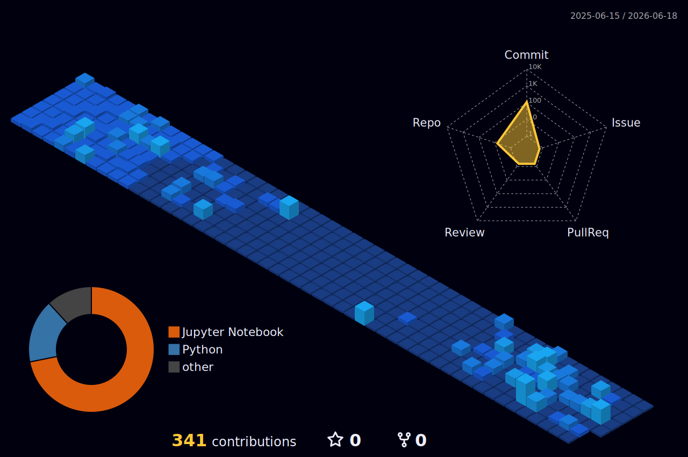

  

 

### 🧠 Sobre Mim

Estudante de **Ciência de Dados e IA** na UFPB, movido pela resolução de problemas.

- 🔬 Pesquisador no **LIM** e no **TRIL**
- ⚙️ Diretor de Automação na **CortechX**
- 🤖 Orquestração de **pipelines agentísticos** e **RAG com LLMs**
- 📦 Construção de sistemas de **Machine Learning** de alto impacto

 

---

 

## 🛠️ Tech Stack

**Linguagens**

**IA & Frameworks**

**Infra & Deploy**

---

 

## 📊 Métricas & Atividade

 

 

---

 

<!-- FOOTER WAVE -->

