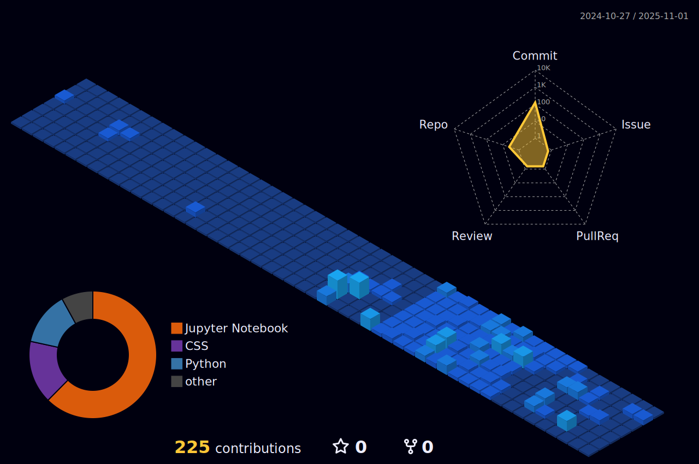

<h1 align="center">Olá! 👋 Eu sou o Gustavo Afonso</h1>

📠Estudante de <strong>Ciência de Dados e Inteligência Artificial</strong> na <strong>UFPB</strong>  
🚀 Focado por aprender e explorar o mundo da tecnologia e ciência de dados  
🔬 Buscando contribuir com a <strong>comunidade científica</strong> e crescer como desenvolvedor  
📫 Entre em contato: <a href="mailto:gustavoafonso892@gmail.com">gustavoafonso892@gmail.com</a>

---

## 🛠️ Tecnologias aprendidas

  
  
  
  
  
  
  
  
  
  
  
  
  
  
  
  
  

---

## 🌱 Oque estou trabalhando no momento

- Machine Learning & Deep Learning 🤖
- Estatística e Probabilidade 📊
- Python para análise e ciência de dados 🐍
- Versionamento com Git e GitHub 🧑‍💻

---

---

<!-- Proudly created with GPRM ( https://gprm.itsvg.in ) -->
